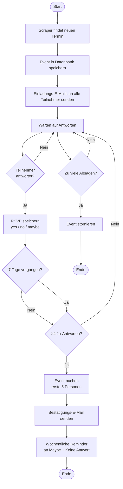
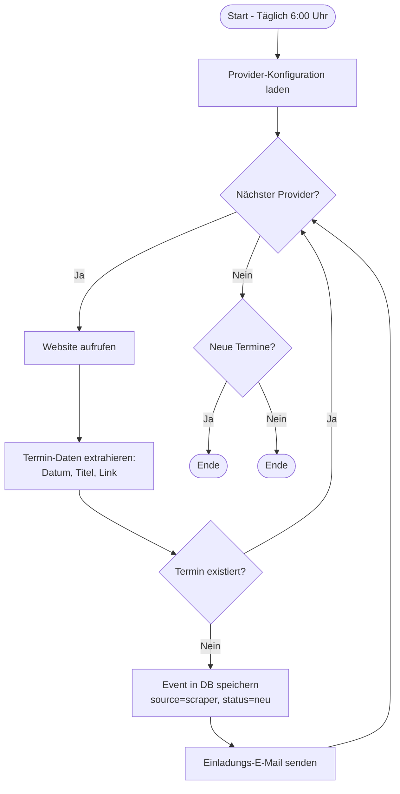
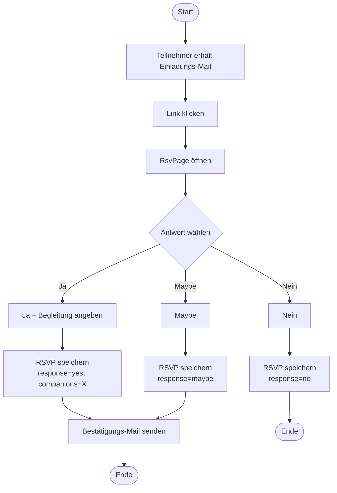
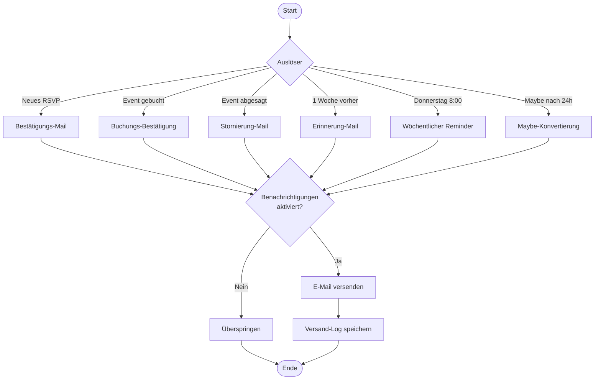
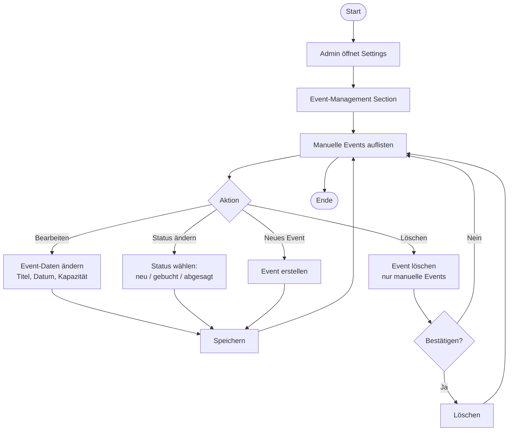
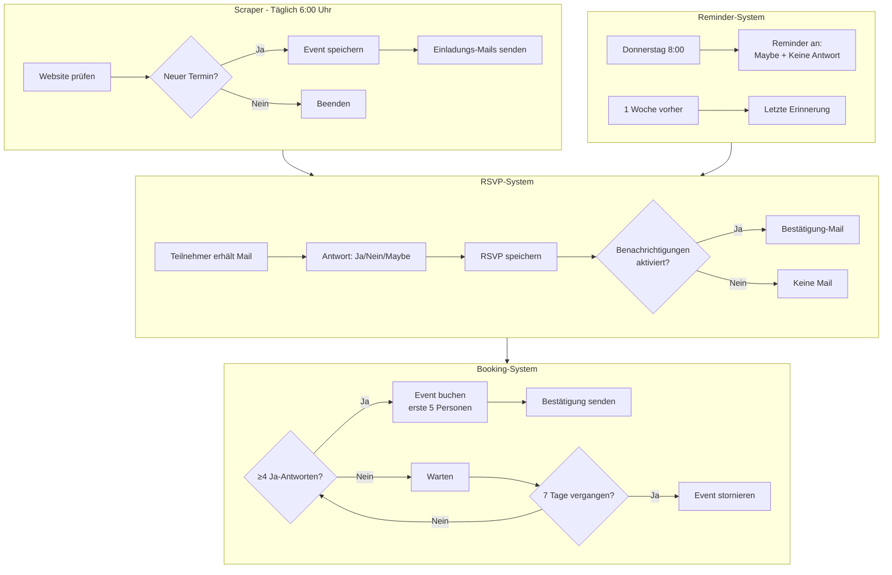

# Quiz-Master Prozess-Diagramme (Mermaid-Code)

Kopiere die Code-Blöcke und füge sie ein unter:
- **Mermaid Live Editor:** https://mermaid.live/
- **GitHub README:** Mit ```mermaid ... ``` umschließen
- **Notion:** Code-Block mit "Mermaid" wählen
- **VS Code:** Extension "Markdown Preview Mermaid Support"

---

## 1. Anmeldungsprozess (Event Booking)



---

## 2. Scraper-Prozess (Termin-Suche)



---

## 3. RSVP-Prozess (Teilnahme-Bestätigung)



---

## 4. E-Mail-Versand-Prozess



---

## 5. Admin-Event-Management



---

## 6. Vollständiger System-Überblick



---

## Quick-Start Anleitung

1. **Gehe zu:** https://mermaid.live/
2. **Kopiere** einen der Code-Blöcke oben
3. **Einfügen** in das linke Textfeld
4. **Diagramm erscheint automatisch** rechts
5. **Download:** Klick auf "Actions" → "Download PNG" oder "SVG"
